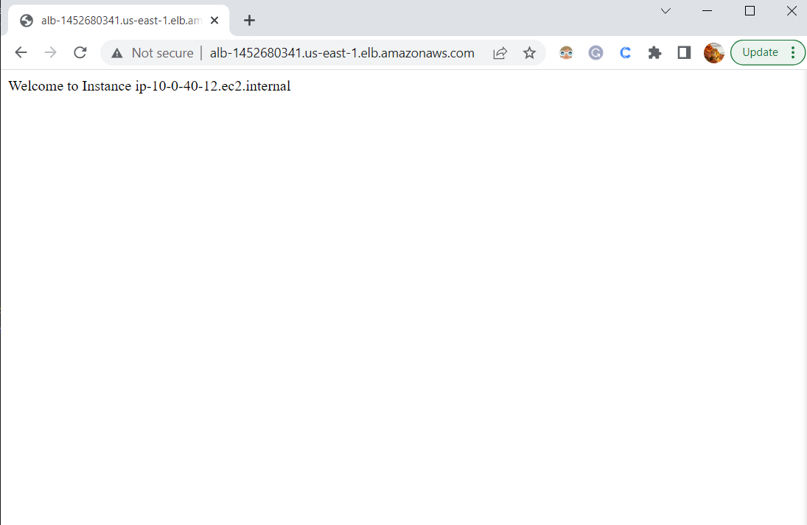

# TERRAFORM 3-EC2 INSTANCES BEHIND AN ELASTIC APPLICATION LOAD BALANCER (ALB),S AND CONFIGURE WITH BASH USERDATA

## DEPLOYMENT ELEMENTS
1. Create a VPC
2. Create 3 Public Subnets
3. Create 3 Internet Gateways
4. Public Route Tables
5. Security Group
6. Three EC2 Instances
7. Create Target Group and ALB

### Step 1: Define Provider Details
- Create [provider.tf](./provider.tf) to mention cloud provider details.

### Step 2: Provide the Required Variables
- Define all required variables in the [variable.tf](./variable.tf) file.

### Step 3: Set up the necessary Networking Components
- Create the [vpc_subnet.tf](./vpc_subnet.tf) file to set up VPC, Subnets, Internet gateways, Route Tables.

### Step 4: Create Custom Security Group
- Create the [security.tf](./security.tf) file to allow for SSH, HTTP and HTTPS connections.
  
### Step 5: Create 3 EC2 Instances
- Create an [ec2.tf](./ec2.tf) file.

### Step 6: Fetch Availability Zone and Instance Role Details Using Data Block
- Create the [data.tf](./data.tf) file.

### Step 7: Create Target Group and Application Load Balancer (A.L.B)
- View the [alb.tf](./alb.tf) file. The target group makes our deployed servers the target of our A.L.B.

### Step 8: Create a Shell Script for Bootstrapping Few Tasks
- Create a bash [userdata](userdata-apache-ami.sh) file.

### Step 9: Provide a Few Required Outputs
- The [Output.tf](output.tf) file helps us obtain useful data including our instances' public IP addresses and the DNS of our ALB.
------------------------------------------------------------------------
> After creating all required tf files, we initiate terraform to download every necessary module and providers. Before doing that we can format all tf files to make them more readable using `terraform fmt`. 
>
> `terraform validate`: This command is used to validate the codes which are written. If there is any syntax mismatching, then it will throw an error to get this fixed, else, you'd get a prompt that says, `Success! The configuration is valid.`
>
> `terraform init`: This command initializes the providers and/or modules mentioned in your script(s). Which means by running this cmd, terraform simply downloads all APIs relevant to your specific cloud provider and modules to ensure successful execution of further operations.

> `terraform plan`: after `terraform init` runs successfully, `terraform plan` displays the details of how terraform will proceed with executing all the commands stated in our script(s) to provision our desired resources in the right order.
>
> `terraform apply`: with `terraform apply` we finally deploy our script(s) to provision all the resources we have stated in our actual cloud environment (which in this case is AWS).
>
> Finally, paste the `alb_id` from the output on your browser, and refresh multiple times to view the ALB balancing the load across the three different ec2-instances. See snapshots .
> -------------------------------------------------------------------------------
> ACKNOWLEDGEMENT: [How to Deploy a Set of EC2 Instances behind an ALB Using Terraform by Plain English](https://plainenglish.io/blog/deploy-a-set-of-ec2-instances-behind-an-alb-using-terraform-403fe584f09e)